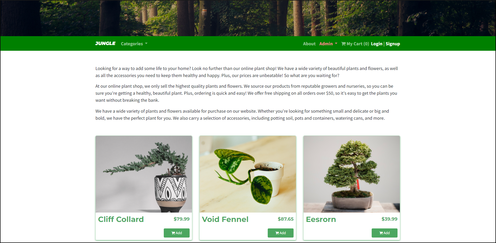
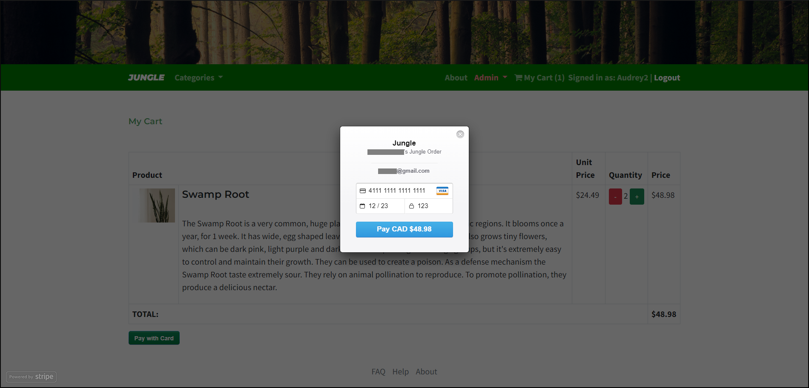
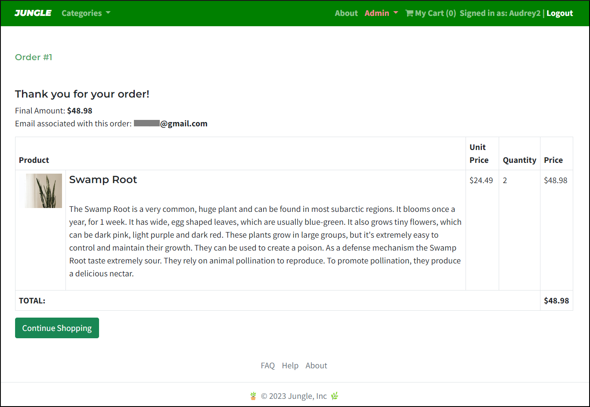
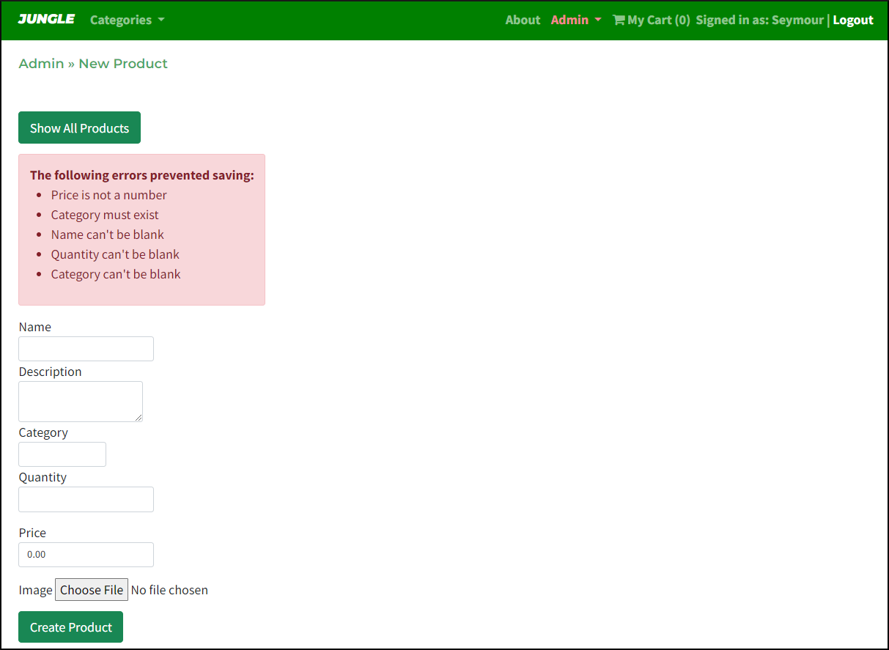

# 🪴 Jungle 

Jungle is a a mini e-commerce application built with Rails 6.1. 🚂\
Additional design enhancements have been integrated as project Stretch Features, to ensure a consistent user experience. 🌿\
Utilizes Rspec & Cypress automated testing to ensure and maintain code reliability and quality. 🧪

## Final Product

**Demo Video:**

https://github.com/kazvee/jungle_rails/assets/109990289/fb683726-38d1-4fd8-8c28-53e3d05bbd8d

**Video of Cypress test runner:**

https://github.com/kazvee/jungle_rails/assets/109990289/a8287459-bcb7-4aa2-b2d9-46c282580f8c

**Screenshot of Landing Page:**

**Screenshot of Stripe Payment Page:**  

**Screenshot of Order Confirmation Page:**  

**Screenshot of New Product Validation Page:**  

### Store Features

**Our valued customers are the root of our growing business 🌱**\
**We are proud to offer *fern*tastic quality plants at blooming low prices 🌸**\
**Come visit today, we promise you won't leaf empty-handed 🌿**

Our shop provides a smooth and visually consistent shopping experience for customers.\
With a range of menus and filtering options, we invite our website guests to interact with and explore our range of beautiful plants.

Additionally, store Admins have access to login-protected menus, enabling them to efficiently manage store inventory and product categorisation.

### User Section

* **Landing Page**
  - Offers a visually appealing overview of all products, with dynamic product stock availability badges

* **Product Details**
  - Provides detailed information and product specifications

* **Categories Menu**
  - Enables customers to browse through various categorized lists of products

* **Products Menu**
  - Discover the entire range of products offered at this store

* **Checkout Page**
  - Review shopping cart contents, make any adjustments, and proceed to order

* **Order Summary**
  - Receive a detailed summary of the completed order

* **About Us**
  - Learn more about our online shop and the lovely people who run it

### Admin Section

**Restricted access via basic HTTP authentication**

* **Admin Dashboard**
  - View all categories and products in one place for efficient store management

* **Products Administration**
  - Manage all available products from a single page
  - **Add New Product Page**
    - Create new products easily
    - Built-in validation for each data field ensures inventory database accuracy

* **Categories Administration**
  - Manage all item categories from a single page
  - **Add New Category**
    - Create new categories easily

## Purpose

This project was created by [me](https://github.com/kazvee) as part of my learnings at [Lighthouse Labs](https://www.lighthouselabs.ca/en/web-development-flex-program).

## Setup

1. Run `bundle install` to install dependencies
2. Create `config/database.yml` by copying `config/database.example.yml`
3. Create `config/secrets.yml` by copying `config/secrets.example.yml`
4. Run `bin/rails db:reset` to create, load and seed both the `development` and `test` databases
5. Create .env file based on .env.example
6. Sign up for a Stripe account
7. Put Stripe (test) keys into appropriate .env vars
8. Run `bin/rails s -b 0.0.0.0` to start the server

## Database

If Rails is complaining about authentication to the database, uncomment the user and password fields from `config/database.yml` in the development and test sections, and replace if necessary the user and password `development` to an existing database user.

## Testing

### Rspec

Use command `bin/rspec` to run all tests (specs) in the `spec` directory.\
Alternatively run `bin/rspec --format documentation` for more verbose results, or create a `.rspec` file in project root which contains `--format documentation` to keep the flag on.

### Cypress

Use command `bin/rails cypress:open` to run all tests in the `cypress/integration` folder.

## Stripe Testing

Use Credit Card # 4111 1111 1111 1111 for testing success scenarios.

More information in their docs: <https://stripe.com/docs/testing#cards>

## Dependencies

- Rails 6.1 [Rails Guide](http://guides.rubyonrails.org/v6.1/)
- Bootstrap 5
- PostgreSQL 9.x
- Stripe
